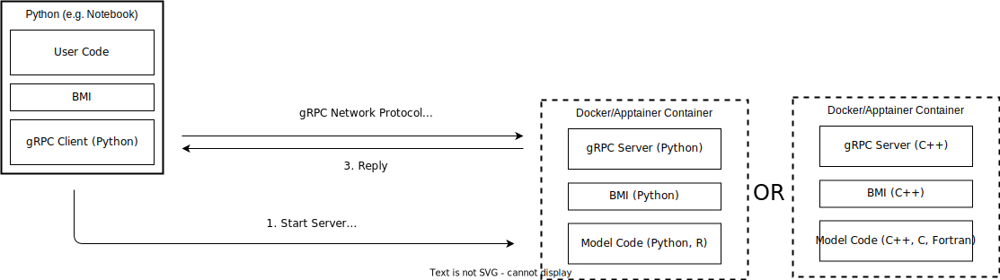

Introduction
============

The Basic Modeling Interface (BMI, see https://github.com/csdms/bmi) is a multi-language library interface tailored to earth system models. This software allows you to wrap a BMI implementation in a server process and communicate with it via the included python client. The communication is serialized to protocol buffers by GRPC (https://grpc.io/) and occurs over network ports. On the server side, we support BMI implementations in :ref:`python <pythonservice>`, R or C/C++. Fortran models need to be linked against the C-version of the BMI. On the client side, we expose the standard python BMI (https://github.com/csdms/bmi-python/).

This setup enables you to wrap your BMI-enabled model in a Docker (https://www.docker.com/) or Singularity (https://singularity.lbl.gov/) container  and communicate with it from a python process on the host machine.

